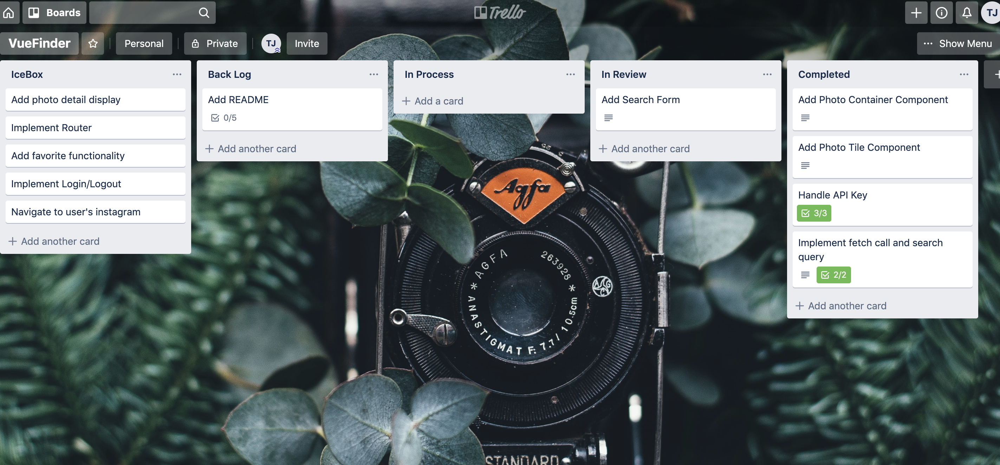
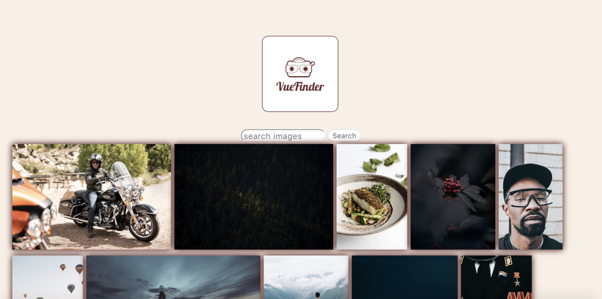
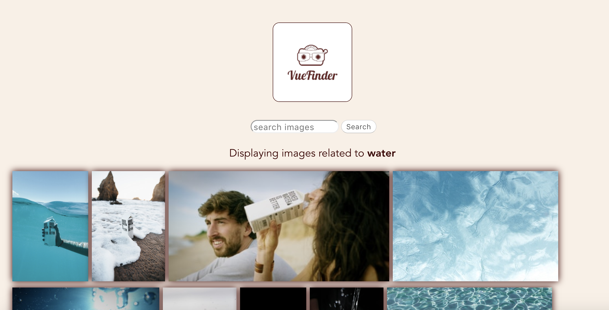

# VueFinder

## Description
VueFinder is an application that allows a user to view and search open source photos based on whatever query they type into the search bar. This project features the Unsplash API for which documentation can be found [here](https://unsplash.com/documentation). This project was given as a take home challenge with just a few days to complete. This is my first implementation of a Vue application.

## Project setup
From the command line:

```
git clone https://github.com/TaylorNoelJordan/VueFinder.git <project name>
cd <project name>
npm install
npm run serve

```

## Project Successes
I'm very excited to have been able to put together a small simple application in just a few days time with a framework I've never seen or worked with before. I took my time reading documentation and watching tutorials to have as good of a grasp on the concepts as possible as I began to code. 

## Project Challenges
I was hoping that Vue would be easier to pick up with how many applications I've built in React, but they're really very different. The initial learning phase took almost the entire time alotted for the project leaving me with about 24 hours to put something together. This also meant I didn't have time to complete any testing (but now I'm curious, so I'm going to try and tackle it anyway).

## Project Extensions/Issues
* Add a testing suite
* Clickable detail display for each image
* Favoriting images
* User account feature
* Route that leads dirctly to Instagram

## Project Tech Emphasis
* Vue
* Asyncronous JS
* Fetch API
* Heroku
* HTML
* CSS

## Project Management
I used Trello for my project management needs.


## Project Comps:

### Home Page



### GIFS


Please enjoy! Feel free to take a peek at my other projects or message me with questions.
[Taylor Jordan](https://github.com/TaylorNoelJordan?tab=repositories)